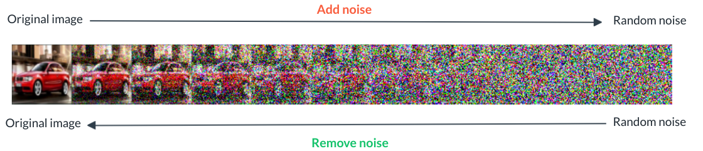
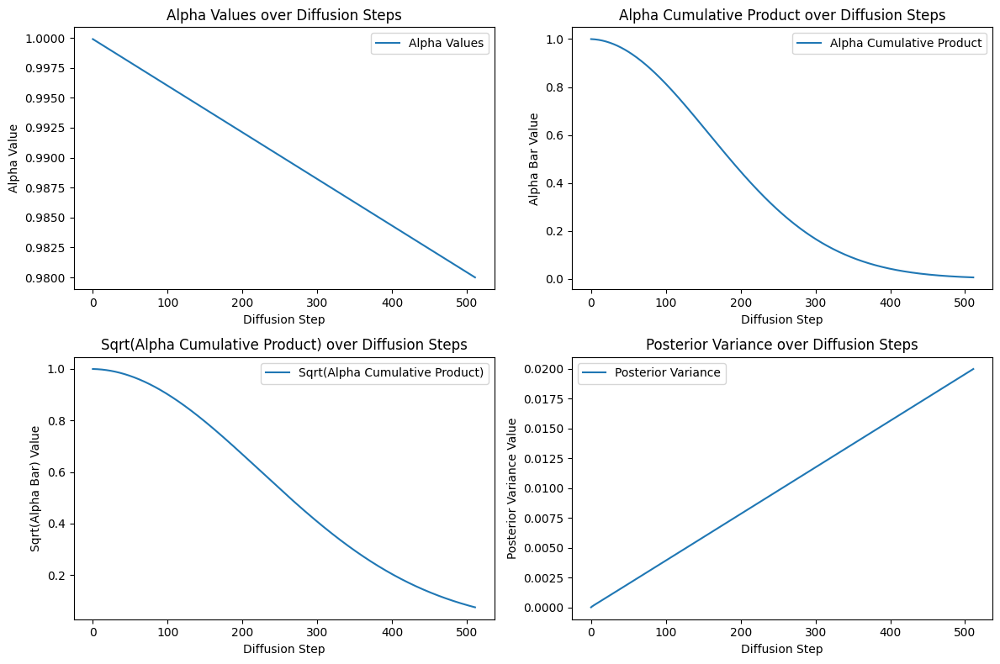
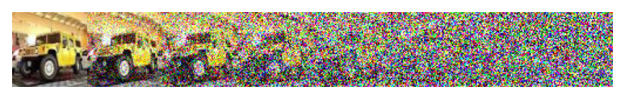
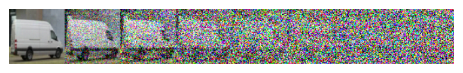
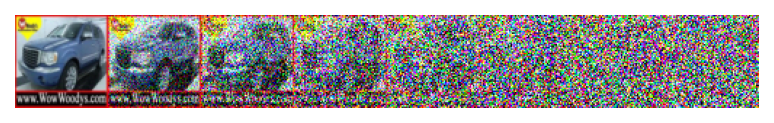
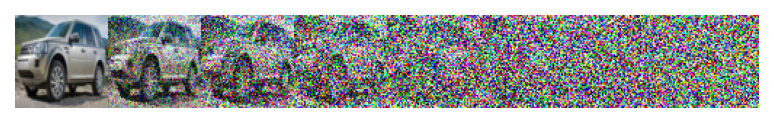
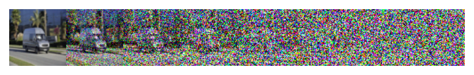

# Train a Denoising Diffusion Probabilistic Model from scratch

We will train a DDPM from scratch. After training the model will be able to generate images of cars.



---

## Environment Setup Instructions

To install the required libraries and dependencies, you can create a conda environment using the provided `environment.yml` file. Follow the steps below:

1. Clone this repository to your local machine.

```py
git clone https://github.com/MayurHulke/Diffusion-model-from-scratch.git
```
2. Navigate to the directory where the `environment.yml` file is located.
3. Open a terminal or command prompt.
4. Run the following command to create the conda environment:

```bash
conda env create -f environment.yml
conda activate DDPM
```

## Precomputed constants



These plots visualizes several key terms related to the diffusion process that were pre-calculated in the previous cell. The visualizations are laid out in a 2x2 grid, each plotting a different term as a function of the diffusion step. Let's dive into each subplot:

1. **Alpha Values over Diffusion Steps:**
   - This plot shows the alpha values (alphas) across the diffusion steps. Alpha values represent the proportion of the original signal that is retained after each step of adding noise. A plot of alpha values provides insight into how much original content is preserved as the diffusion process progresses.

2. **Alpha Cumulative Product over Diffusion Steps:**
   - The second plot visualizes the cumulative product of alpha values (alphas_cumprod). This measure reflects the cumulative effect of noise addition over time, indicating the overall proportion of the original signal still present after \( t \) steps. The curve typically shows a decreasing trend, illustrating the gradual transition from data to noise.

3. **Sqrt(Alpha Cumulative Product) over Diffusion Steps:**
   - This subplot displays the square root of the cumulative product of alpha values (sqrt_alphas_cumprod). The square root operation is often applied in diffusion models for scaling purposes during both the forward and reverse processes. This plot helps to understand the scaling factor applied to the data or noise at each step.

4. **Posterior Variance over Diffusion Steps:**
   - The final plot shows the posterior variance (posterior_variance) across the diffusion steps. The posterior variance is a critical parameter in the reverse diffusion process, guiding the amount of noise that needs to be removed at each step to recover the original data from its noised version. The plot of posterior variance across steps provides insight into how the uncertainty about the original data decreases as we move backward through the diffusion process.

---
## Diffusion steps

Below are the diffusion steps, from the original image to the left all the way to pure noise to the right.







---

## Final Results

 In the Notebook I only trained it for 3 epochs but If you were to train for much longer, and/or use a larger model (for example, the one defined above in the commented lines has 55 Million parameters) and let it train for several hours, we would get something even better, like this:

 