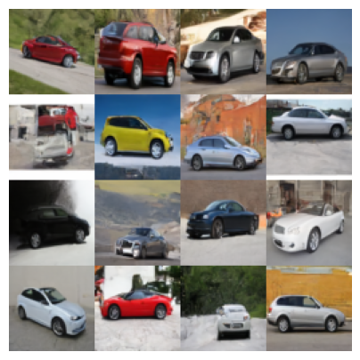

# Denoising Diffusion Probabilistic Model from Scratch

This project involves training a Denoising Diffusion Probabilistic Model (DDPM) from scratch to generate high-quality images of cars. By leveraging the principles of diffusion models, this project demonstrates the capability to generate new data samples that mimic the distribution of a given dataset. After thorough training, the model can produce realistic images of cars, showcasing the potential of diffusion models in generative tasks.


## Project Overview

- **Objective**: To understand and implement a DDPM capable of generating realistic images of cars.
- **Techniques Used**: Diffusion processes, reverse diffusion, neural network training (U-Net architecture), and various PyTorch techniques.
- **Results**: The model, after training, generates images that closely resemble real cars, illustrating the power of diffusion models in generative applications.

## Purpose and Educational Value

This project is developed with an educational purpose in mind, aimed at enthusiasts and learners who are keen on a white-box understanding of Denoising Diffusion Probabilistic Models (DDPMs). By building a DDPM from scratch, I enjoy understanding the inner workings of such models, providing a clear and comprehensive insight into their mechanisms, challenges, and immense potential in generative tasks.

## Environment Setup Instructions

A detailed setup is essential for replicating the project results. The environment setup involves creating a dedicated conda environment with all necessary dependencies.

1. **Clone the Repository**:
   - Use the following command to clone the project repository:
     ```bash
     git clone https://github.com/MayurHulke/Diffusion-model-from-scratch.git
     ```

2. **Create and Activate the Conda Environment**:
   - Navigate to the cloned directory and run:
     ```bash
     conda env create -f environment.yml
     conda activate DDPM
     ```

## Training Process

The training involves several steps, from setting up a reproducible environment to initializing the model and defining the training loop. Key components include:

- **Reproducibility**: Ensuring that results are consistent across runs by setting seeds and using deterministic algorithms.
- **Data Preparation**: Loading and preprocessing the Stanford Cars dataset, including resizing and normalization.
- **Model Architecture**: Implementing and utilizing a U-Net model, tailored for the diffusion process.
- **Training Dynamics**: Leveraging optimizers, learning rate schedules, and specifically designed loss functions to train the model effectively.

### Precomputed Constants Visualization

Precomputed constants such as alpha values and their cumulative products are vital for both the forward and reverse diffusion processes. Their visualization helps understand the model's behavior throughout the diffusion steps.


### Diffusion Steps Visualization

Visualizing the diffusion steps offers insights into how the model progressively adds noise to the images until they resemble pure noise, and how it recovers the original image from noise through the reverse process.


## Final Results and Conclusion

The project demonstrates the ability to generate realistic images of cars using a DDPM trained from scratch. With more training and a larger model, the quality of generated images significantly improves, showcasing the model's potential in generative tasks.



## Features and Support

- **GPU Acceleration**: The project is designed to utilize GPU resources efficiently, drastically reducing training time.
- **High Customizability**: With adjustable hyperparameters, the model can be tailored to different datasets and requirements.
- **Scalability**: The architecture supports scaling up to larger models for improved quality and detail in generated images.

## Future Work

- **Dataset Expansion**: Experimenting with different and larger datasets to explore the model's versatility.
- **Architecture Enhancements**: Investigating the impact of modifications to the U-Net architecture on the model's performance.
- **Optimization Techniques**: Applying advanced training techniques and optimizations for further improvements in image quality.

---
## Purpose and Educational Value

This project is developed with an educational purpose in mind, aimed at enthusiasts and learners who are keen on a white-box understanding of Denoising Diffusion Probabilistic Models (DDPMs). By building a DDPM from scratch, I intend to demystify the inner workings of such models, providing a clear and comprehensive insight into their mechanisms, challenges, and immense potential in generative tasks.

### For Learners:

- **Deep Dive into DDPMs**: This project serves as a practical guide to understanding the principles, mathematics, and implementation details that underpin DDPMs.
- **Hands-On Experience**: By following along with the project, learners can gain hands-on experience in implementing, training, and experimenting with diffusion models, fostering a deeper understanding of deep learning.
- **Open-Ended Exploration**: The project encourages exploration beyond the provided implementation, inviting learners to tweak, enhance, and adapt the model to different datasets or creative applications.

---

# Stay Updated

If you like this project and are interested in more "WhiteBox" understanding projects, be sure to let me know by giving it a star ⭐ and following me on GitHub.

**More exciting projects are on the way!**

[](https://github.com/MayurHulke/Diffusion-model-from-scratch)
[](https://github.com/MayurHulke)

Click [here](https://github.com/MayurHulke) to visit my profile.


